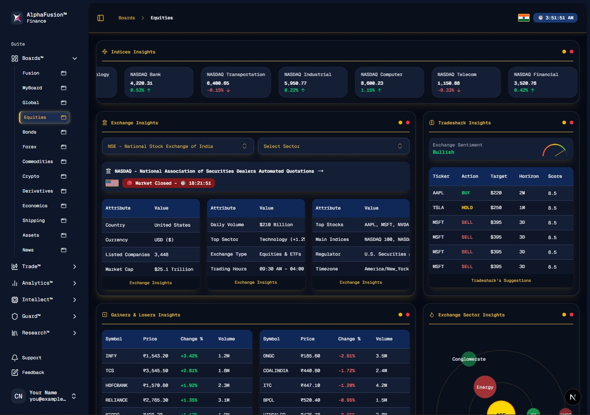

# AlphaFusion™ – Professional Market Intelligence Platform

  

**AlphaFusion™** is a Bloomberg-like, proprietary financial platform integrated with **TradeShark AI**, offering real-time market data, AI-driven forecasts, trading modules, analytics, and research tools for professional traders and institutions.

> ⚠️ **Proprietary Software** – AlphaFusion is not open source and is intended for internal or licensed use only.

---

## Table of Contents

- [Overview](#overview)  
- [FusionBoards™ – Dashboards](#fusionboards)  
- [FusionIntellect™ – AI Tools](#fusionintellect)  
- [FusionTrade™ – Trading Modules](#fusiontrade)  
- [FusionAnalytics™ – Market Analytics](#fusionanalytics)  
- [FusionGuard™ – Risk & Compliance](#fusionguard)  
- [FusionResearch™ – Research Suite](#fusionresearch)  
- [Screenshots](#screenshots)  
- [Disclaimer](#disclaimer)  

---

## Overview

AlphaFusion™ is a professional-grade market intelligence and trading platform that integrates:  

- 🌐 Real-time **global market data** (Equities, FX, Commodities, Bonds, Crypto)  
- 🤖 Advanced **AI forecasting and trading** via TradeShark  
- 📊 **Customizable dashboards** for portfolio monitoring and market insights  
- 📈 **Deep analytics** for quantitative, sentiment, and technical market research  
- 🔒 **Comprehensive risk management** and compliance tools  

---

## FusionBoards™ – Dashboards

Click to expand FusionBoards™

| Dashboard | Description | UI Elements |
|-----------|-------------|-------------|
| **🌎 FusionOne** | Global summary with AI forecasts & trading activity | KPI cards, equity heatmap, news ticker, TradeShark forecast widgets |
| **🛠 MyFusionBoard** | User-customizable dashboards | Drag-drop widgets, resizable tiles, AI recommendations |
| **🌐 GlobalFusion** | Overview of global markets | Split-screen charts, heatmaps, sentiment radar |
| **📈 EquiFusion** | Equity-specific analytics | Candlestick charts, P/E charts, top gainers/losers, institutional flows |
| **💵 BondFusion** | Fixed Income analytics | Yield curves, bond spreads, risk graphs |
| **💱 ForexFusion** | FX pairs & volatility | Real-time pair charts, volatility map, correlation wheel |
| **⛏ CommoFusion** | Commodities market | Live prices, AI predictions, futures calendar |
| **₿ CryptoFusion** | Crypto & DeFi analytics | Live prices, dominance charts, social sentiment |
| **📊 DerivaFusion** | Derivatives (Futures, Options, Swaps) | Options chain, implied volatility charts, open interest |
| **💼 AssetFusion** | Mutual funds & portfolios | Asset allocation visuals, fund metrics |
| **📉 EcoFusion** | Economic indicators | CPI, GDP, employment charts, event calendar |
| **🚢 ShipFusion** | Global shipping analytics | Route maps, vessel positions, congestion index |
| **📰 NewsFusion** | Financial & geopolitical news | AI-clustered news feed, sentiment badges |

---

## FusionIntellect™ – AI Tools

Click to expand FusionIntellect™

| Tool | Description | UI / UX |
|------|-------------|---------|
| **🤖 TradeShark AI** | Market prediction engine | Prediction graphs, confidence gauges, auto-update tickers |
| **🧠 FusionMind** | NLP-based query interface | Chat-style console with interactive chart replies |
| **📊 AlphaBrain** | Personalized AI advisor | Daily trading suggestions, performance insights |
| **⚡ PredictivePulse** | Pattern & anomaly detection | Highlights on charts, alerts center |
| **📑 InsightMesh** | Dashboard summarization | Auto-generated reports with charts & summaries |
| **💻 AutoScript** | Custom trading scripts | Visual editor + code console, save & run scripts |

---

## FusionTrade™ – Trading Modules

Click to expand FusionTrade™

| Module | Description | UI Elements |
|--------|-------------|-------------|
| **💹 TradeStation** | Centralized trading desk | Positions, PnL, order management, charts |
| **🛫 AutoPilot** | AI automated trading | Strategy builder, live execution monitor |
| **🧪 AlgoLab** | Strategy creation & backtesting | Code editor, backtest engine, equity curves |
| **📈 OrderFlow** | Order book visualization | Depth chart, liquidity heatmap |
| **📁 FusionPort** | Portfolio tracker | Pie charts, rebalance recommendations, risk-return analytics |
| **🔗 API Bridge** | Broker integrations | Fyers, Zerodha, Binance, Coinbase linking wizard |

---

## FusionAnalytics™ – Market Analytics

Click to expand FusionAnalytics™

| Feature | Description | UI Elements |
|---------|-------------|-------------|
| **📊 QuantLens** | Performance & risk metrics | Sharpe, Alpha, Beta, visual risk-return grid |
| **📰 Sentimatrix** | Sentiment analysis | News/social media sentiment, word clouds, trend charts |
| **💾 DataGrid** | Raw & processed data | SQL-style query explorer, download options |
| **💸 FlowTrack** | Institutional money flows | Sankey charts, inflow/outflow analysis |
| **📈 TechScope** | Technical indicators scanner | Filters by RSI, MACD, Bollinger Bands |
| **🌡 MarketPulse** | Real-time correlation & volatility | Heatmaps, risk color coding |

---

## FusionGuard™ – Risk & Compliance

Click to expand FusionGuard™

| Feature | Description | UI Elements |
|---------|-------------|-------------|
| **🛡 RiskMatrix** | Portfolio & market risk engine | VaR curves, drawdown tracker, heatmaps |
| **⛓ CompliChain** | Blockchain compliance | Immutable transaction & audit logs |
| **🚨 ThreatLens** | Fraud & anomaly detection | Alerts center, fraud likelihood scores |
| **🔒 GuardAI** | API & data security monitor | Live security dashboard, status cards |
| **📜 AuditTrail** | Full trade & user audit | Timeline view, session filters |

---

## FusionResearch™ – Research Suite

Click to expand FusionResearch™

| Feature | Description | UI Elements |
|---------|-------------|-------------|
| **📘 StockIntel** | Company reports & filings | File viewer, AI highlights of metrics |
| **📄 FusionDocs** | Reports & financial statements | AI summarization, highlights key metrics |
| **📅 EventHorizon** | Calendar & economic forecasts | Event calendar, AI impact charts |
| **🏛 Fundamental** | Deep company analysis | Valuation metrics, peer comparison, history timeline |
| **🌍 GeoScope** | Geopolitical risk mapping | Interactive world map, sentiment overlays |
| **📊 MacroMap** | Macro-economic visualization | Dynamic analytics dashboards, sliders |
| **📝 FusionPaper** | AI-generated research papers | Draft PDFs, citations, data integration |

---

## Screenshots

> Below are some screenshots of AlphaFusion™ dashboards and modules. The path `x` is used as the root folder for images.

  
   
  <em>EquiFusion – Equities Market Overview Dashboard</em>

---

## Disclaimer

⚠️ **Proprietary Software** – AlphaFusion™ is a licensed, private platform. This repository is for internal or authorized use only and **is not open source**. Any redistribution, reproduction, or public use is strictly prohibited.
